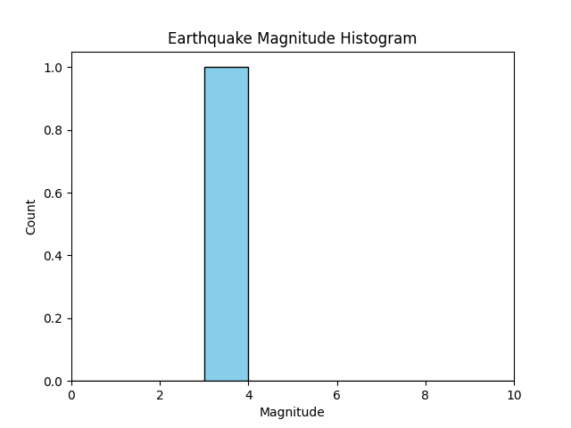
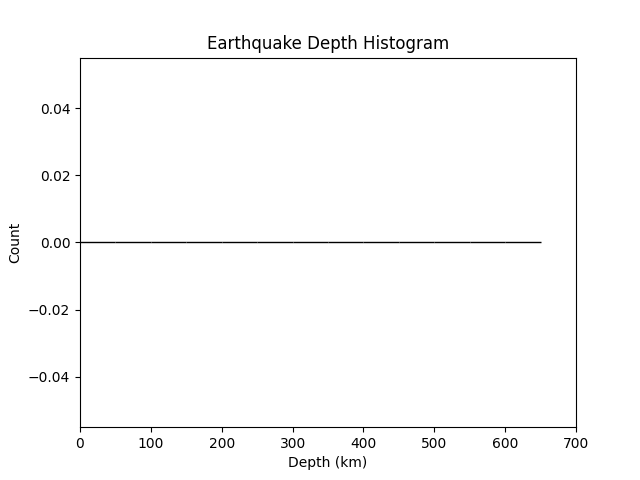
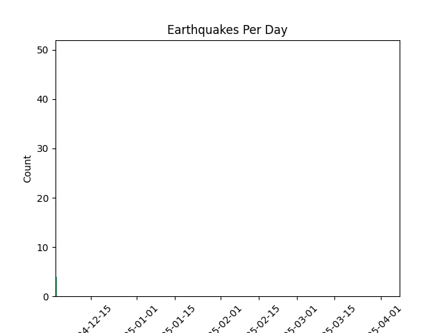
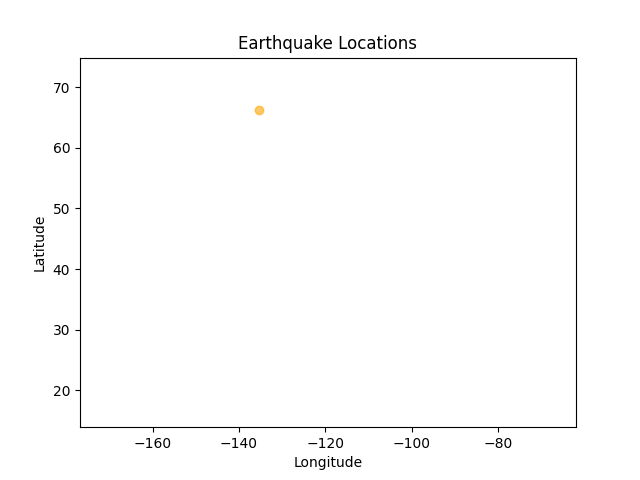
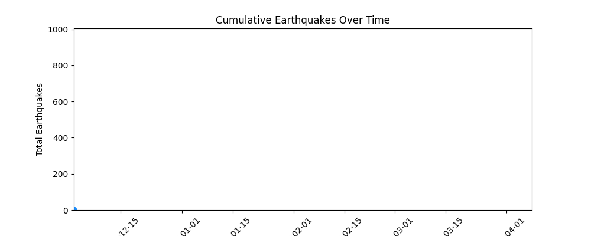
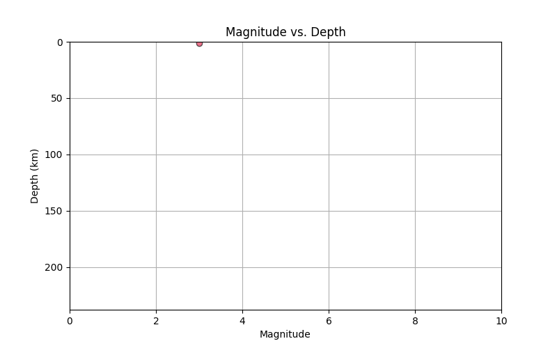
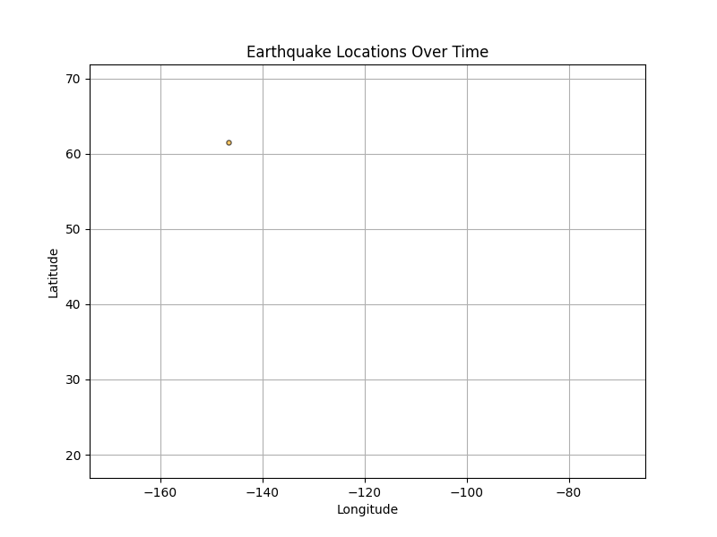
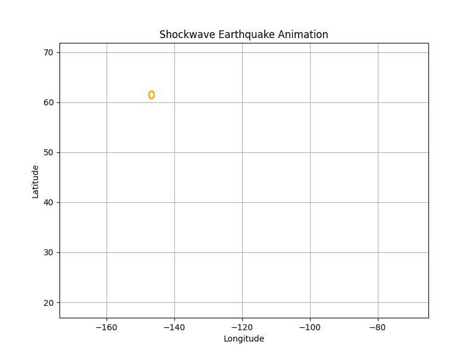
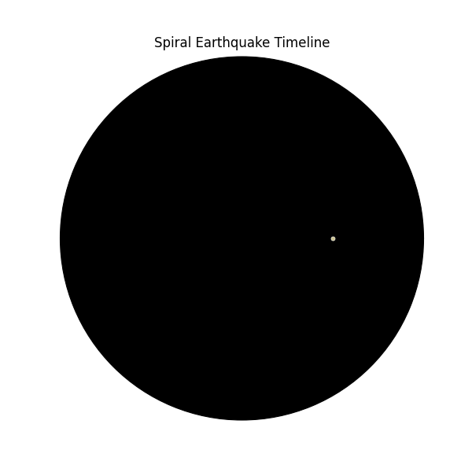
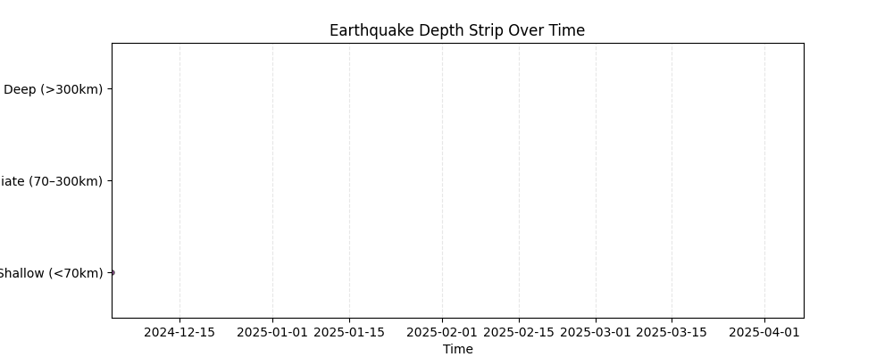

# 🌍 USGS Earthquake Visualizer

[](https://www.python.org/)
[](https://streamlit.io/)
[](https://pandas.pydata.org)
[](https://docs.python-requests.org)
[](https://geopandas.org/)
[](https://python-visualization.github.io/folium/)
[](https://matplotlib.org/)
[](https://seaborn.pydata.org/)
[](https://earthquake.usgs.gov/)
[](https://www.docker.com)

---

## 📖 Overview

An interactive geospatial dashboard that allows users to fetch and explore recent earthquake events using the [USGS Earthquake Catalog API](https://earthquake.usgs.gov/fdsnws/event/1/). Users can filter events by location (country), time, and magnitude, and view results on an interactive map with animated data visualizations.

---

## 🚨 Live on Streamlit Cloud

> 🟢 Try it now: [🌍 USGS Earthquake Visualizer](https://art-of-data-analysis-earthquake-viz.streamlit.app/)

---

## 🚀 Features

- **Country-Specific Filtering**: Select a country from a dropdown sourced from Natural Earth shapefiles.
- **Interactive Map (Folium)**:
  - Color by depth (yellow/orange/red)
  - Size by magnitude (exponential scaling)
  - Clustered markers with tooltips & popups
  - Layer toggles (OpenStreetMap, Terrain, Satellite)
- **Custom Filters**:
  - Start date, end date
  - Minimum magnitude
  - Max number of events
- **Animated Chart Grid**:
  - Magnitude histogram
  - Depth histogram
  - Time series (events over time)
  - Location scatter (lat/lon)
- **Advanced Visualizations in Tabs**:
  - Cumulative timeline
  - Magnitude vs. depth scatter
  - Earthquake location timeline
  - Shockwave ripple animation
  - Spiral timeline
  - Depth strip chart
- **Data Table + CSV Export**:
  - Clean `st.dataframe` view
  - Download filtered results as CSV
- **Caching & Performance**:
  - API caching (15 mins)
  - Shapefile caching

---

## 📊 Data Sources & Credits

- **USGS Earthquake Catalog API**: [earthquake.usgs.gov](https://earthquake.usgs.gov/fdsnws/event/1/)
- **Natural Earth Shapefiles**: Admin 0 – Countries  
  [naturalearthdata.com](https://www.naturalearthdata.com/)

---

## 📊 How It Works

1. **User Input**: Choose a country and filter options from the sidebar.
2. **Geo Filtering**: Country boundaries from Natural Earth are used to form bounding box.
3. **API Query**: Fetches earthquake GeoJSON data from USGS.
4. **Map Rendering**: Folium displays events as color/size-coded markers.
5. **Chart Animations**: Matplotlib renders GIFs saved in `data/output_charts/`.
6. **DataFrame & CSV**: Displayed in `st.dataframe` and downloadable.

---

## 🖼️ Earthquakes in USA from 2024/04/09 to 2025/04/09 (Sample Output Gallery Charts)
All visualizations are dynamically generated using real earthquake data.

| Chart | Description |
|-------|-------------|
|  | Histogram showing distribution of magnitudes |
|  | Histogram of earthquake depths (in km) |
|  | Events per day over the selected time range |
|  | Earthquake locations plotted on 2D map |
|  | Cumulative earthquake timeline |
|  | Scatter plot of magnitude vs depth |
|  | Timeline-based location animation |
|  | Shockwave ripple effect for each event |
|  | Spiral plot encoding time, depth, magnitude |
|  | Horizontal strip chart grouping depth zones |

---

## 📁 Project Structure

```
earthquake_viz/
├── app/
│   ├── config/            # API and shapefile paths
│   ├── core/              # API calls, data processing, geospatial utils
│   ├── ui/                # Streamlit UI components
│   ├── visualizations/    # Map builder & animated charts
│   └── main.py            # Streamlit entry point
├── data/                  # Natural Earth shapefiles & Output folder for .gif charts
├── requirements.txt       # Dependency list
└── README.md              # Project documentation
```

---

## ⚙️ Setup Instructions

### 1. Clone the Repository
```bash
git clone https://github.com/sandy-sp/art-of-data-analysis.git
cd projects/earthquake_viz
```

### 2. Create and Activate Virtual Environment
```bash
python3 -m venv venv
source venv/bin/activate  # Windows: venv\Scripts\activate
```

### 3. Install Dependencies
```bash
pip install -r requirements.txt
```

### 4. Download Shapefile(if required)
- URL: https://www.naturalearthdata.com/downloads/110m-cultural-vectors/110m-admin-0-countries/
- Extract to: `data/shapefiles/ne_110m_admin_0_countries/`

### 5. Run the App
```bash
streamlit run app/main.py
```

---

## 📄 License

MIT License © [Sandy](https://github.com/sandy-sp)

---

## 🙏 Connect with Me

- [LinkedIn](https://www.linkedin.com/in/sandeep-paidipati)
- [GitHub](https://github.com/sandy-sp)
- [Data Portfolio](https://github.com/sandy-sp/art-of-data-analysis)

