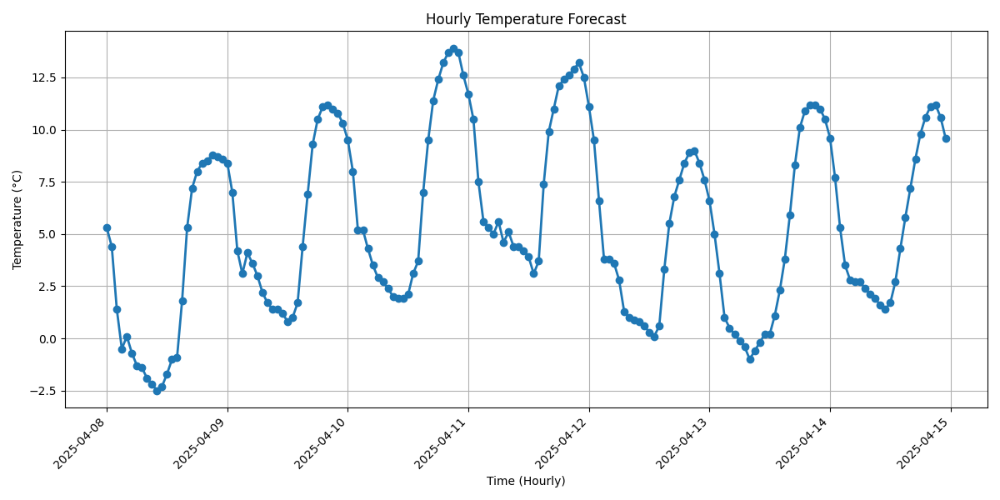
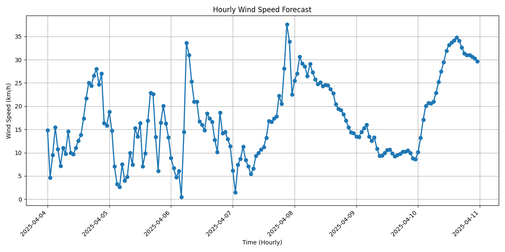
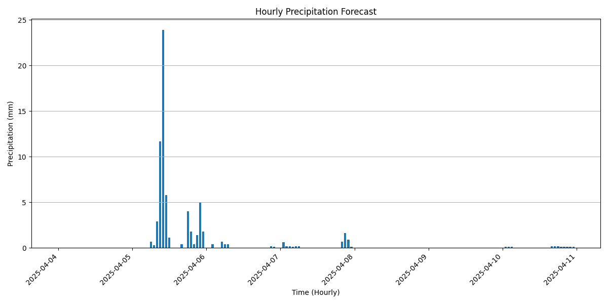
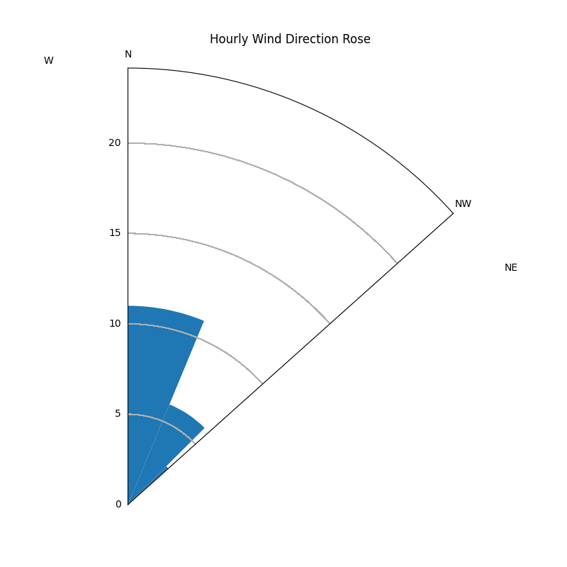
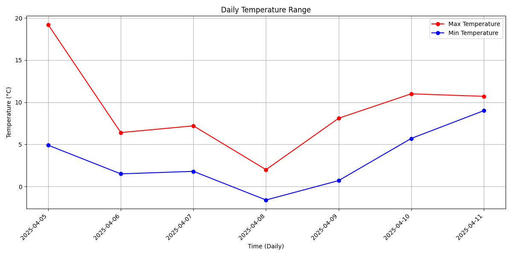
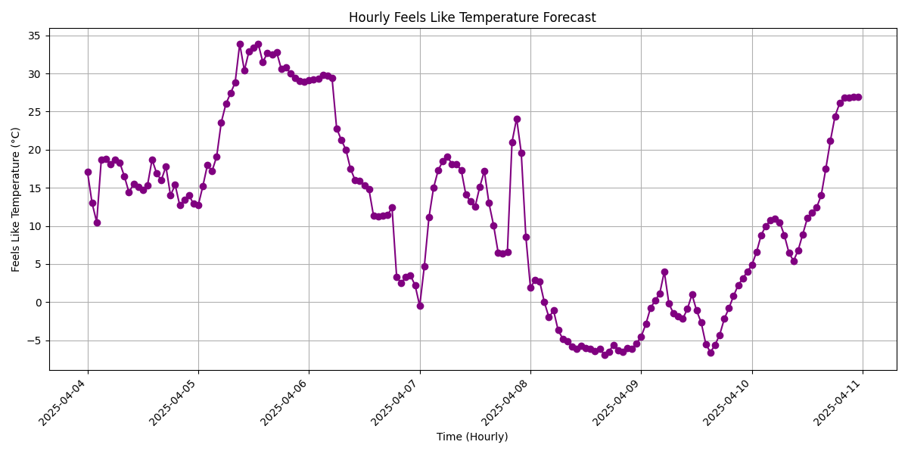
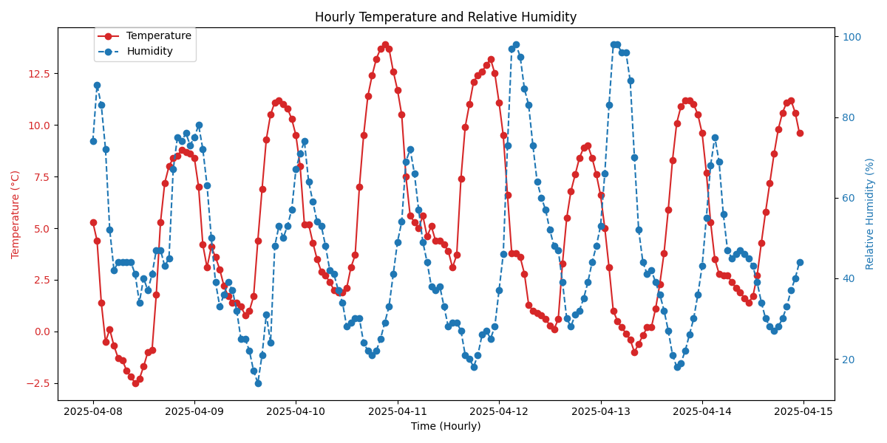

# Weather Data Visualization Project

This project fetches weather forecast data from the Open-Meteo API and generates various visualizations, including temperature, wind speed, precipitation, wind direction, daily temperature range, "feels like" temperature, and a combined temperature and humidity plot.

## Table of Contents

1.  [Installation](#installation)
2.  [Usage](#usage)
3.  [Visualizations](#visualizations)
    * [Hourly Temperature](#hourly-temperature)
    * [Hourly Wind Speed](#hourly-wind-speed)
    * [Hourly Precipitation](#hourly-precipitation)
    * [Hourly Wind Direction](#hourly-wind-direction)
    * [Daily Temperature Range](#daily-temperature-range)
    * [Hourly "Feels Like" Temperature](#hourly-feels-like-temperature)
    * [Hourly Temperature and Humidity](#hourly-temperature-and-humidity)

## Installation

1.  Clone this repository (if applicable).
2.  Navigate to the project directory: `cd weather_viz`
3.  Install the required dependencies: `pip install -r requirements.txt`

## Usage

1.  Ensure you have an internet connection to fetch data from the API.
2.  Run the main script to generate the visualizations: `python src/main.py`
3.  The generated visualization images will be saved in the `reports/visualizations` directory.
4.  You can view the visualizations below.

## Visualizations

### Hourly Temperature

This plot shows the hourly temperature forecast for Cleveland, OH over the next 7 days. The y-axis represents the temperature in Celsius (°C), and the x-axis represents the time in hourly intervals.

### Hourly Wind Speed

This plot shows the hourly wind speed forecast for Cleveland, OH over the next 7 days. The y-axis represents the wind speed in kilometers per hour (km/h), and the x-axis represents the time in hourly intervals.

### Hourly Precipitation

This plot shows the hourly precipitation forecast for Cleveland, OH over the next 7 days. The y-axis represents the precipitation in millimeters (mm), and the x-axis represents the time in hourly intervals. The precipitation is visualized using a bar chart.

### Hourly Wind Direction

This plot shows the distribution of hourly wind directions for Cleveland, OH using a wind rose. The plot indicates the frequency of winds blowing from different directions.

### Daily Temperature Range

This plot shows the daily temperature range for Cleveland, OH over the next 7 days, with separate lines for the maximum and minimum temperatures.

### Hourly "Feels Like" Temperature

This plot shows the hourly "feels like" temperature forecast for Cleveland, OH, calculated from temperature and humidity. It represents how the temperature actually feels to people.

### Hourly Temperature and Humidity

This plot combines the hourly temperature and relative humidity on a single chart, using two different y-axes. The temperature is shown in Celsius (°C) and the humidity is shown as a percentage (%).