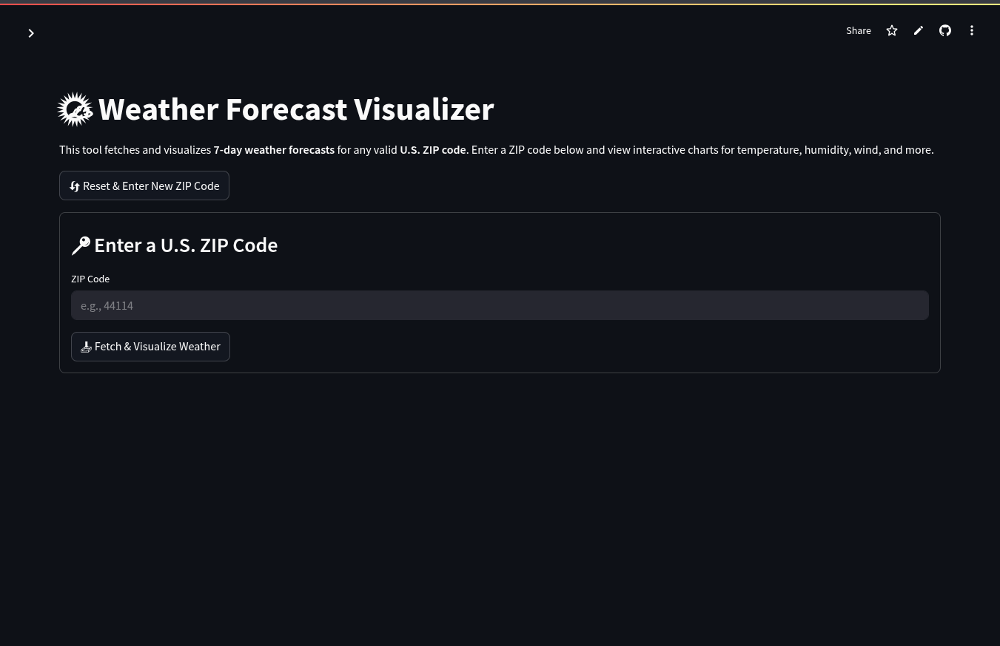

# 🌦️ Weather Forecast Visualizer
[](https://www.python.org)
[](https://streamlit.io)
[](https://plotly.com)
[](https://pandas.pydata.org)
[](https://docs.python-requests.org)
[](https://pypi.org/project/pgeocode)
[](https://pypi.org/project/openpyxl)
[](https://www.docker.com)


An interactive web app to visualize hourly and daily weather forecasts using the [Open-Meteo API](https://open-meteo.com/). Built with **Streamlit** and **Plotly**, this tool fetches real-time weather data based on ZIP code input and displays interactive visualizations for temperature, humidity, wind, and precipitation.

---

## 📦 Features

- U.S. ZIP code-based forecast lookup with validation
- Interactive visualizations for:
  - Hourly & daily temperature
  - Feels-like temperature
  - Humidity & precipitation
  - Wind speed, direction, and vector field
  - Combined temperature & humidity
- Download weather data as CSV and Excel
- Sidebar with social links and project README reference
- Responsive layout for wide and narrow screens

---

## 🖥️ Live App Demo

> ✅ Live Demo: [🌦️ Weather Forecast Visualizer](https://art-of-data-analysis-weather-viz.streamlit.app/)


---

## 🚀 Getting Started

### 1. Clone the Repository

```bash
git clone https://github.com/sandy-sp/art_of_data_analysis_projects_weather_viz.git
cd art_of_data_analysis_projects_weather_viz/projects/weather_viz
```

### 2. Install Requirements

Make sure Python 3.8+ is installed.

```bash
pip install -r requirements.txt
```

> `requirements.txt` should include:  
> `streamlit`, `pandas`, `plotly`, `pgeocode`, `requests`, `openpyxl`

### 3. Run the App

```bash
streamlit run app.py
```

Open your browser at `http://localhost:8501`

---

## 🧠 How It Works

- Uses `pgeocode` to convert ZIP code → latitude & longitude
- Queries Open-Meteo API for hourly and daily forecast data
- Processes it into clean `pandas` DataFrames
- Visualizes trends with Plotly (line, bar, polar, and vector plots)
- Presents UI via Streamlit with user-friendly layout and controls

---

## 📁 Project Structure

```
weather_viz/
├── app.py                      # Streamlit app entry point
├── requirements.txt
├── src/
   ├── api_handler.py          # Fetches weather data from API
   ├── data_processor.py       # Cleans and enriches raw API data
   └── visualizations/         # All interactive Plotly visualizations
    .....
```

---

## 📸 Sample Video
[](assets/weather_viz.mp4)

---

## 📋 License

MIT License © [Sandy](https://github.com/sandy-sp)

---

## 🤗 Connect with Me

If you liked this project and want to connect or collaborate:

- [LinkedIn](https://www.linkedin.com/in/sandeep-paidipati)
- [GitHub](https://github.com/sandy-sp)
- [Project README](https://github.com/sandy-sp/art-of-data-analysis/tree/main/projects/weather_viz)

